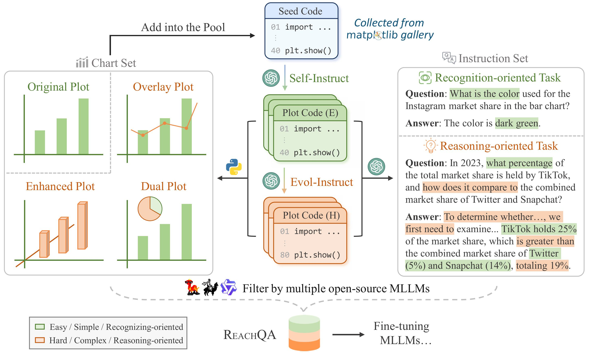
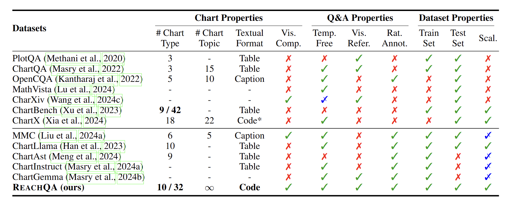
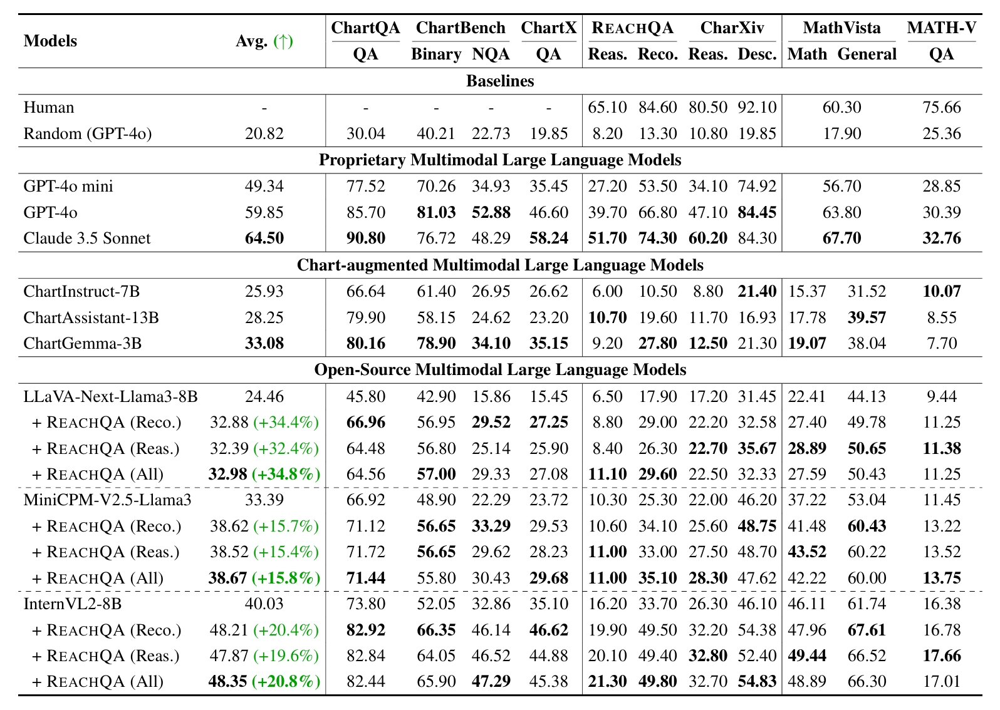
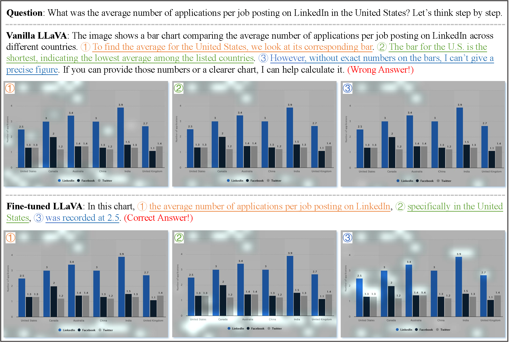

<div align=center><h1>
    🪄Distill Visual Chart Reasoning Ability<br>
    from LLMs to MLLMs
</h1></div>

This is the official repository for 📃 [Distill Visual Chart Reasoning Ability from LLMs to MLLMs](#).

You have two options to obtain our dataset:

1. Download directly from the 🤗**HuggingFace** Dataset: [ReachQA](#)
2. Clone this repository and **generate 📈charts using the synthetic code**: The process takes about **3 minutes**!

## 📖Introduction

### Code-as-Intermediary Translation

We propose **Code-as-Intermediary Translation (CIT)**, a cost-effective, efficient and easily scalable data synthesis method for distilling visual reasoning abilities **from LLMs to MLLMs**.  The code serves as an intermediary that translates visual chart representations into textual representations, enabling LLMs to understand cross-modal information. Specifically, we employ text-based synthesizing techniques to construct chart-plotting code and produce **ReachQA**, a dataset containing 3k **rea**soning-intensive **ch**arts and 20k Q&A pairs to enhance both recognition and reasoning abilities.  Experiments show that when fine-tuned with our data, models not only perform well on chart-related benchmarks, but also demonstrate improved multimodal reasoning abilities on general mathematical benchmarks such as MathVista.

<div align=center></div>

> Figure: Overview of the CIT method for synthesizing multimodal instruction data. The process begins with **33 seed codes** and generates plot codes across various chart types, topics, and complexity levels through the Self-Instruct and Evol-Instruct stages. The chart set and instruction set are constructed bi-directionally, and the final filtered data yields ReachQA, a dataset for distilling visual chart reasoning abilities from LLMs to MLLMs.

### ReachQA

> Table: Comparison of existing chart-related datasets across **three properties**. Only the chart question-answering (CQA) task is considered, despite some datasets having multiple tasks. Abbreviations: Vis.=visual, Comp.=complexity, Temp.=template, Refer.=Reference, Reas.=reasoning, Rat.=rationale, Annot.=annotation and Scal.=scalable.

<div align=center></div>

> Table: ReachQA dataset statistics. Question and answer lengths are calculated based on the GPT-4o tokenizer.

| **Statistics**         | **Train Set** | **Test Set** |
| ---------------------- | ------------- | ------------ |
| **Total charts**       | 3,249         | 500          |
| - # Chart types        | 10 / 32       | 10 / 32      |
| - # Overlay plots      | 1,030         | 220          |
| - # Multiple plots     | 593           | 251          |
| - Average size (px)    | 2480×1571     | 2798×1601    |
| **Unique questions**   | 19,963        | 2,000        |
| - # Reco. per chart    | 2.53          | 2            |
| - # Reas. per chart    | 3.62          | 2            |
| **Average Length**     |               |              |
| - Avg. Reco. Q. length | 22.1          | 21.0         |
| - Avg. Reco. A. length | 38.3          | 7.0          |
| - Avg. Reas. Q. length | 38.2          | 35.4         |
| - Avg. Reas. A. length | 68.4          | 24.9         |

## ⚡️Install

1. For dataset usage:
```bash
git clone https://github.com/hewei2001/ReachQA.git
cd ReachQA
conda create -n ReachQA_data python=3.10 -y
conda activate ReachQA_data

pip install -r requirements_data.txt
pip install lmdeploy # Optional, for MLLM filter
```

2. For training / evaluation usage:
```Shell
git clone https://github.com/hewei2001/ReachQA.git
cd ReachQA
conda create -n ReachQA_train python=3.10 -y
conda activate ReachQA_train

git clone https://github.com/modelscope/swift.git
cd swift
pip install -e '.[llm]'
pip install timm
```

## 🌳Project Structure

```
ReachQA
 ├── assets
 ├── data
 │   ├── reachqa_seed
 │   ├── reachqa_test
 │   └── reachqa_train
 ├── scripts
 │   ├── data
 │   ├── eval
 │   ├── filter
 │   └── train
 ├── utils
 │   ├── chart_notes.py
 │   ├── openai_utils.py
 │   └── __init__.py
 ├── batch_filter_image.py
 ├── batch_filter_QA.py
 ├── openai_generate_code.py
 ├── openai_generate_QA.py
 ├── openai_llm_evaluation.py
 ├── swift_infer_dataset.py
 ├── requirements_data.txt
 └── README.md
```
| File                     | Description                                |
|--------------------------|--------------------------------------------|
| assets/                  | Folder for project-related resources       |
| data/                    | Folder for dataset storage                 |
| scripts/                 | Folder for scripts to run |
| utils/                   | Folder for utility functions               |
| batch_filter_QA.py      | Code for filtering Q&A with MLLMs |
| batch_filter_image.py    | Code for filtering images with MLLMs |
| openai_generate_QA.py    | Code for synthesizing Q&A |
| openai_generate_code.py  | Code for synthesizing code for charts |
| openai_llm_evaluation.py | Code for LLM-as-a-Jugde evaluation |

## 📈Quick Start

1. **Obtain ReachQA dataset in 3 minutes:**

```bash
cd ReachQA
conda activate ReachQA_data

python ./data/reachqa_train/execute_code.py \
	--code_dir ./data/reachqa_train/code/ \
	--image_dir ./data/reachqa_train/images/ 
	
python ./data/reachqa_test/execute_code.py 
	--code_dir ./data/reachqa_test/code/ \
	--image_dir ./data/reachqa_test/images/ 
```

2. **Data Construction with CIT:**

Before generating, the parameters in the `scripts/` should be modified!

```bash
cd ReachQA
conda activate ReachQA_data

# Generate code
bash ./scripts/data/run_openai_generate_code.sh

# Execute code and generate images
python ./data/reachqa_train/execute_code.py \
	--code_dir ./data/reachqa_train/all_code/ \
	--image_dir ./data/reachqa_train/all_images/ 

# Filter images
bash ./scripts/filter/run_rating_images.sh
python ./data/reachqa_train/filter_rated_image.py \
	--data_dir ./data/reachqa_train/

# Generate QA
bash ./scripts/data/run_openai_generate_QA.sh

# Filter QA
bash ./scripts/filter/run_rating_QA.sh
python ./data/reachqa_train/filter_rated_QA.py \
	--data_dir ./data/reachqa_train/
```

3. **Training / Inference / Evaluation:**

Before training, the JSON instruction file needs to be processed into **Swift format**!

For the specific format, refer to the [Official Swift Documentation](https://github.com/modelscope/ms-swift/tree/main).
```bash
cd ReachQA
conda activate ReachQA_train

# Swift format
cd ./data/reachqa_train/
python process_to_swift_internvl.py

# Training
cd ../..
bash ./scripts/train/internvl2_lora.sh

# Inference
bash ./scripts/eval/infer_InternVL2-8B.sh

# Evaluation
bash ./scripts/eval/run_openai_evaluation.sh
```
## 📈Main Results

> Table: Evaluation results on seven benchmarks. Details for these benchmarks and models are presented in § 4.1. The best performance for each category and task is in **bold**. The percentage of performance improvements compared to the vanilla model is denoted by (↑).

<div align=center></div>

---

<div align=center></div>

> FIgure: An example of **attention visualization** from the ChartQA dataset. The top row shows the results from the vanilla LLaVA-Next-Llama3-8B model, while the bottom row displays the results from our fine-tuned model. For each output, we present the attention distribution (highlighted zones) at **three key steps**, calculated by averaging the attention values of all tokens in each step.


## 🔎Citation

```
TODO
```
